# Data flow into ADX (time series db)

This lab aims to configure the Azure IoT Operations dataflow to ingest data into Azure Data Explorer (ADX). It is based on the [official documentation](https://learn.microsoft.com/en-us/azure/iot-operations/connect-to-cloud/howto-configure-adx-endpoint).

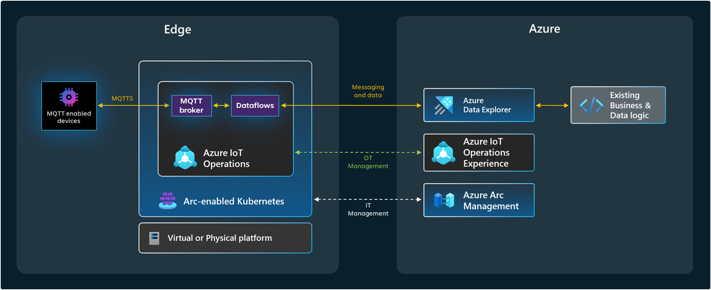

Following the architecture above, the scenario is to ingest data from a MQTT topic into an ADX database table. The data is expected to be in JSON format and the schema is defined as follows:

```json
{
    "AssetId": "thermostat-01",
    "Temperature": 40.2,
    "Timestamp": "2024-10-14T21:29:33.050631+00:00"
}
```


## Step 1. Prepare Azure Data Explorer (ADX)

### Create ADX Cluster

Create a new cluster or use an existing one (e.g., Dev/Test size) and make sure you enable "Streaming ingestion" at the cluster level. This can also be changed after creation:

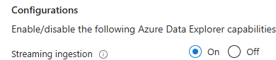

In the Permissions option, add the `AllDatabasesAdmin` role to your own user. This will simplify some of the operations you will need to execute later.

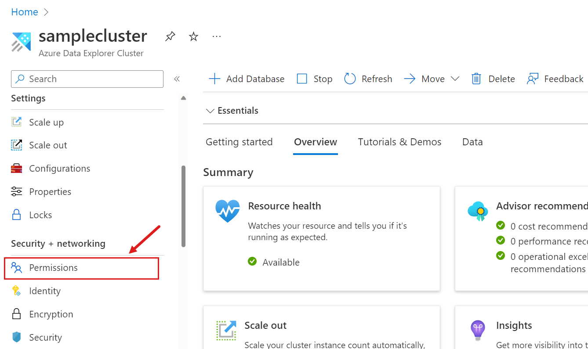


### Create database and table

In the Azure Portal create a new database (e.g., `iot`):

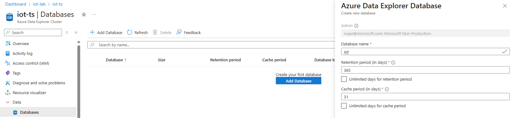

Enable streaming ingestion for the new database:

```kql	
.alter database ['iot'] policy streamingingestion enable
```

You need to create a table to hold the ingested data. Navigate to the ADX cluster, click on the "Query" button and execute the following KQL commands:

```kql	
.create table SensorData (
    AssetId: string,
    Temperature: real,
    Timestamp: datetime
)
```

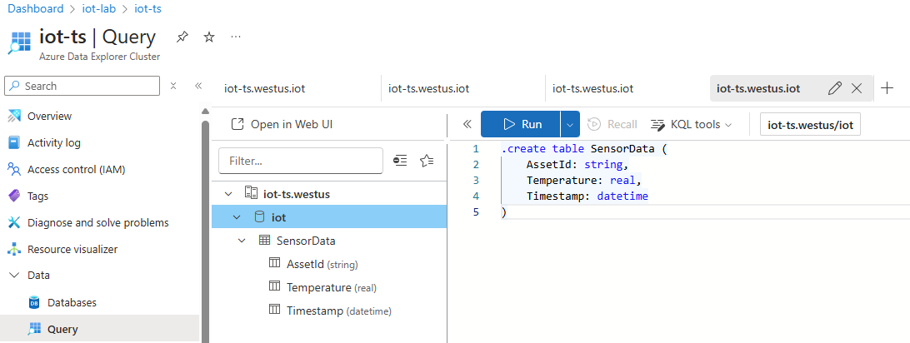


### Add AIO permissions on ADX

Azure IoT Operations creates a managed identity automatically and assigns it to the Azure Arc-enabled Kubernetes cluster. We need to give the managed identity permission to write to the ADX database.

The managed identity created has the same name as the AIO extension in the Arc-enabled cluster. In Azure portal, go to the Arc-connected Kubernetes cluster and select Settings > Extensions. In the extension list, find the name of your Azure IoT Operations extension and copy the name of the extension.

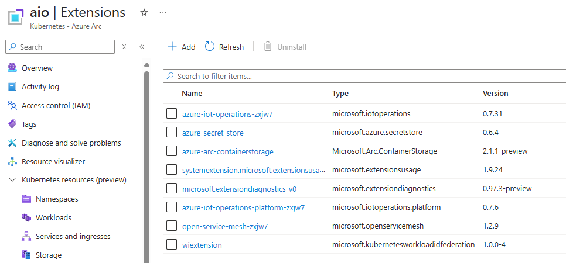

In this example the name is `azure-iot-operations-zxjw7`.

In your Azure Data Explorer, navigate to your database and under Overview select Permissions > Add > Ingestor. Search for the Azure IoT Operations extension name then add it.

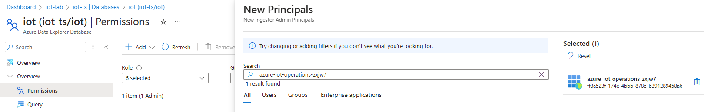


## Step 2. Configure dataflow

### Configure and deploy the dataflow

The provided file `adx-dataflow.bicep` deploys all the necessary artifacts, namely:
- Message schema: that defines the structure of the incoming data.
- ADX dataflow endpoint: that defines the connection to the ADX cluster.
- ADX dataflow: that defines the flow of data from the MQTT broker to the ADX cluster.

The bicep template can be deployed using the shell script `create-adx-dataflow.sh` that collects environment variables from a `.env` file. Copy the provided `.env.template` to a new file `.env` and customize it according to your environment.

```
resource_group="resource group name"
location="location name"
customLocationName="Custom location name"
schemaRegistryResourceGroup="Schema registry resource group name"
schemaRegistryName="Schema registry name"
aioInstanceName="AIO instance name"
mqttTopic="MQTT topic name"
adxClusterUri="ADX cluster URI (e.g., https://xpto.region.kusto.windows.net)"
adxDatabaseName="ADX database name"
adxTableName="ADX database table name"
```

After setting up the parameters, run the script to deploy the dataflow:

```bash
./create-adx-dataflow.sh
```

### Validate the deployment

You can check that you have the dataflow created by running the following command:

```bash
kubectl get dataflows -n azure-iot-operations
```

Also check for any errors in the deployment by validating the logs of the `aio-dataflow-operator-0` pod:

```bash
kubectl logs aio-dataflow-operator-0 -n azure-iot-operations
```

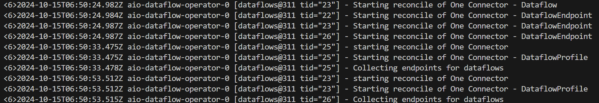

And finally, check if the dataflow is running correctly by validating the logs of the `aio-dataflow-default-0` pod:

```bash
kubectl logs aio-dataflow-default-0 -n azure-iot-operations
```

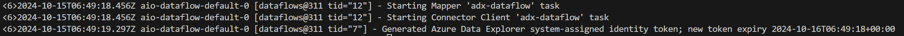

If there are no errors, you can start testing your new dataflow.


## Step 3. Test the dataflow

### Publish messages to the MQTT topic

For testing we need to ingest data into the MQTT topic `thermostats/temperature`. You can use the provided `mosquitto_pub` command to publish a message to the broker:

```bash
# Start a shell into the mqtt-client pod
kubectl exec --stdin --tty mqtt-client -n azure-iot-operations -- sh

# In the shell run the following command to publish a message (if using SAT auth)
mosquitto_pub -q 1 -t thermostats/temperature -d -V mqttv5 -m "{\"AssetId\":\"thermostat-01\",\"Temperature\":40.2,\"Timestamp\":\"2024-10-14T21:29:33.050631+00:00\"}" -i thermostat -h aio-broker -p 18883 --cafile /var/run/certs/ca.crt -D CONNECT authentication-method 'K8S-SAT' -D CONNECT authentication-data $(cat /var/run/secrets/tokens/broker-sat)

# Alternative if using x509 auth
mosquitto_pub -q 1 -t thermostats/temperature -d -V mqttv5 -m "{\"AssetId\":\"thermostat-01\",\"Temperature\":40.2,\"Timestamp\":\"2024-10-14T21:29:33.050631+00:00\"}" -i thermostat -h aio-broker -p 18883 --cert /tmp/foo.crt --key /tmp/foo.key --cafile /tmp/chain_server_client.pem
```

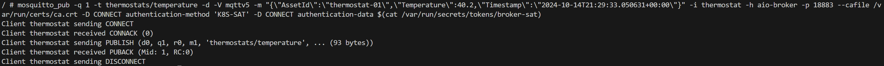

You can also subscribe to the topic to check if messages are being ingested correctly:

```bash
# If using SAT auth
mosquitto_sub --host aio-broker --port 18883 --topic "thermostats/temperature" -v --debug --cafile /var/run/certs/ca.crt -D CONNECT authentication-method 'K8S-SAT' -D CONNECT authentication-data $(cat /var/run/secrets/tokens/broker-sat)

# Alternative if using x509 auth
mosquitto_sub -t thermostats/temperature -d -V mqttv5 -h aio-broker -p 18883 --cert /tmp/foo.crt --key /tmp/foo.key --cafile /tmp/chain_server_client.pem
```

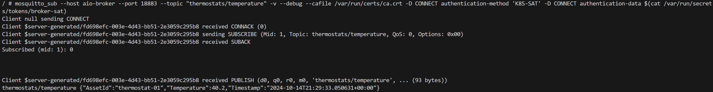

### Check the data in ADX

If everything is working fine, you should be able to see data being ingested on the ADX table. Use the following KQL query to check the data:

```kql
SensorData
| project AssetId, Temperature, Timestamp
```

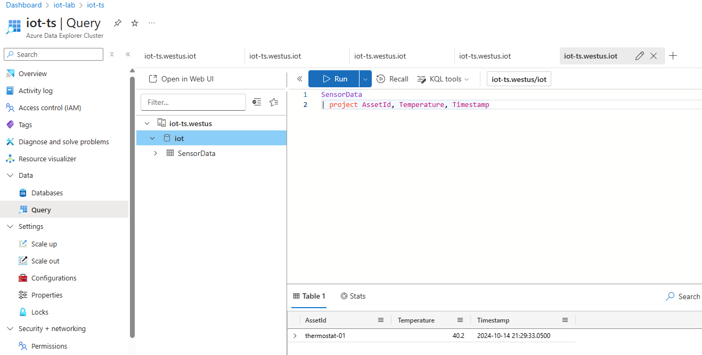
